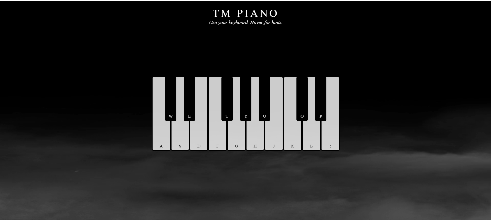

# Virtual Piano

## Overview

Looking to play some piano notes but don’t have a physical instrument? No worries! **Virtual Piano** is a simple, interactive web-based piano that brings the joy of playing the piano right to your fingertips. Built using HTML, CSS, and JavaScript, this project allows users to play piano notes by pressing keys on their keyboard. It’s lightweight, responsive, and perfect for musicians and beginners alike.

Whether you’re a seasoned pianist or just looking to explore your musical side, Virtual Piano lets you enjoy the sounds of a piano anytime, anywhere!

## Features

- **Interactive Keyboard**: A fully functional piano keyboard that responds to your keyboard inputs.
- **Sound Playback**: Plays the corresponding piano notes when the keys are pressed.
- **Responsive Design**: Works seamlessly on all devices, including desktops, tablets, and mobile phones.
- **Visual Feedback**: Keys highlight as they are pressed, creating a more engaging and realistic piano-playing experience.

## Screenshot

## How It Works

1. **HTML** is used to structure the piano keys and layout.
2. **CSS** ensures the keyboard is styled cleanly and remains responsive.
3. **JavaScript** handles detecting keyboard input and playing audio corresponding to each key.
4. When a key is pressed, the project plays the corresponding piano sound and visually highlights the key being pressed.

### Key Mapping
- Press **W, E, T, Y, U, O, P** to play piano notes.
- Press **A, S, D, F, G, H, J, K, L, ;** to play the lower octave notes.

  
### Usage

1. Clone or download the repository.
2. Open the `index.html` file in your web browser.
3. Start playing piano by pressing the designated keys on your keyboard.

## Contribution

We welcome contributions to improve Virtual Piano! Here’s how you can contribute:

1. **Fork the repository**.
2. **Create a new branch**: `git checkout -b feature-branch`.
3. **Make your changes**: `git commit -m 'Add new feature'`.
4. **Push the branch**: `git push origin feature-branch`.
5. **Submit a pull request**.

--- 
Enjoy!